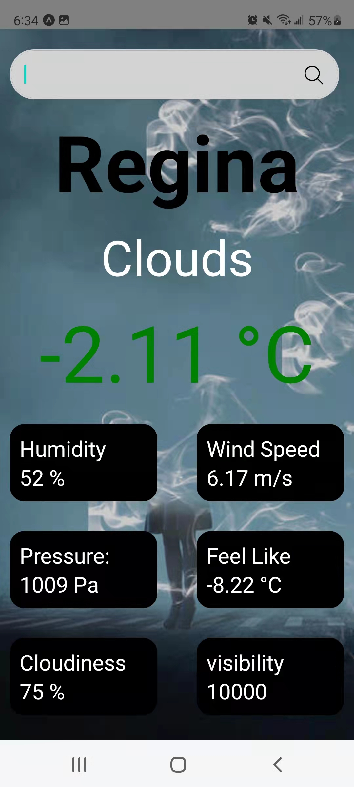

# real-project-ryn445
#Weather Forecast
---

This is a respository for my Final Project at University of Regina CS455 class.

___Last Update 4/10/2022___

## Menu

1. [Configuration instructions](#Configuration-instructions)
2. [Installation instructions](#Installation-instructions)
3. [Operating instructions](#Operating-instructions)
4. [manifest](#manifest)
5. [Copyright information](#Copyright-information)
6. [Contact information](#Contact-information)
7. [Bug list](#Bug-list)
8. [Troubleshooting tips](#Troubleshooting-tips)
9. [Credits and acknowledgments](#Credits-and-acknowledgments)


## Configuration instructions
 iOS 10.0 and Android 9.0 (API 28) or newer. 

## Installation instructions
1. use Expo
2. click new snack 
3.Select import git repository 
4. Copy & Paste the link：https://github.com/BUNSE-BRAVE/real-project-ryn445
## Operating instructions
- There is a Search Bar and Some imformation about Regina weather from OpenweatherMap
- user click on the search bar to search the city they want.



- If user click on the search bar, and type the city name,such as shanghai


-sucn as Toronto


- If the user enters an incorrect city name, the user can only re-enter it


## Manifest

```
--
--
- README.md ----> The file you are reading right now.
```

## Copyright information
@ Ruijie Yang, University of Regina
## Contact information
- Ruijie Yang ryn445@uregina.ca
## Bug list
-The city name should not be too long
## Troubleshooting tips
Please send an email to me if you have any trouble
## Credits and acknowledgments
-Instructor: Trevor Tomesh
-React Native
-expo
-and many other people
