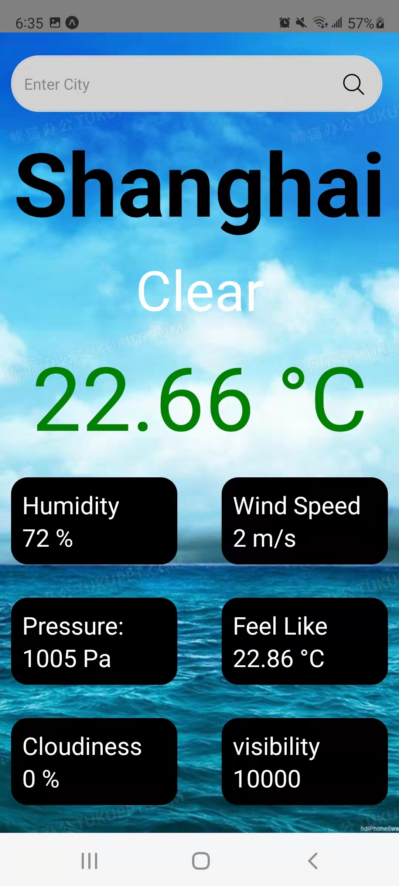
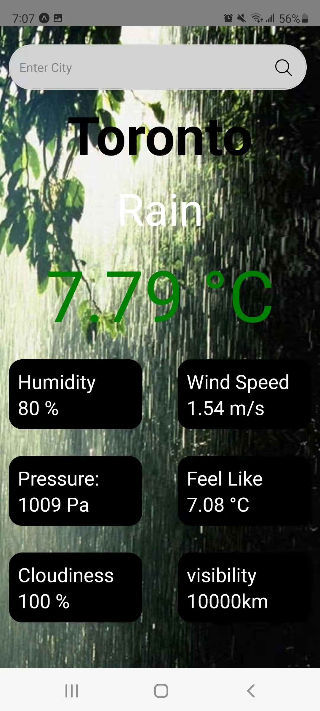
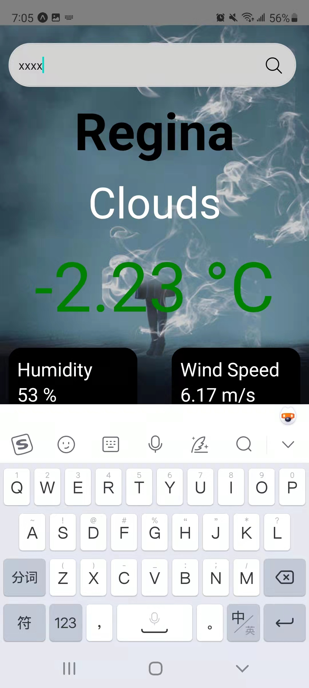
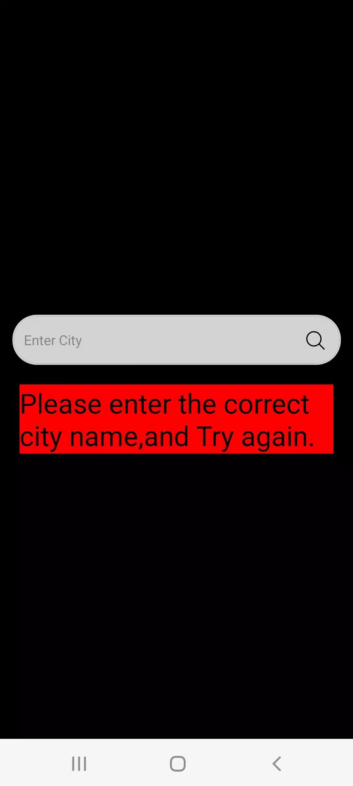
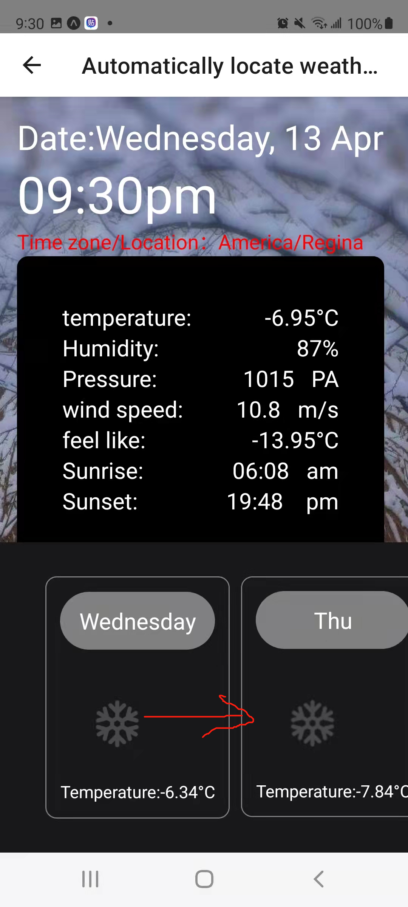
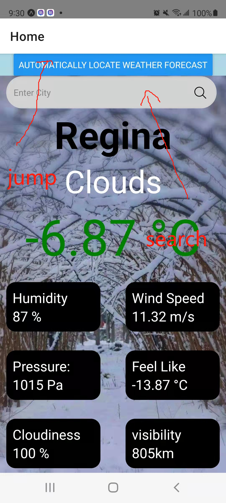

# real-project-ryn445
#Weather Forecast
---

This is a respository for my Final Project at University of Regina CS455 class.


## Menu

1. [Configuration instructions](#Configuration-instructions)
2. [Installation instructions](#Installation-instructions)
3. [Operating instructions](#Operating-instructions)
4. [manifest](#manifest)
5. [Copyright information](#Copyright-information)
6. [Contact information](#Contact-information)
7. [Bug list](#Bug-list)
8. [Troubleshooting tips](#Troubleshooting-tips)
9. [Credits and acknowledgments](#Credits-and-acknowledgments)


## Configuration instructions
-Expo 
-android 
-ios
## Installation instructions
1. use Expo
2. click new snack 
3.Select import git repository 
4. Copy & Paste the link：https://github.com/BUNSE-BRAVE/real-project-ryn445
or
scan QR code

-no apk
## Operating instructions
- There is a Search Bar and Some imformation about Regina weather from OpenweatherMap
- user click on the search bar to search the city they want.


- If user click on the search bar, and type the city name,such as shanghai


-sucn as Toronto


- If the user enters an incorrect city name, the user can only re-enter it


If the user wants to automatically load local weather, the user can press the blue button. The home page will jump to another screen.

The second page will load the local time according to the time zone, display some weather information of the day, and at the bottom, there is a scroll bar that can display the weather icon for the next seven days and the temperature of the day.

## Manifest

```App.js ------>Home Navigation
--weathersearchscreen.js ------>Form a home page with a search function and display the results
--weathersearchdetail.js
--weathersearchBar.js

--Forecastscreen.js------>These 3 JS files constitute the automatic positioning location and display the weather forecast page for the next seven days.
--Forecastdetail.js
--ForecastScroll.js
-- README.md ----> my Readme.
```Todolist ----> some fuctions i could add

## Copyright information
@ Ruijie Yang, University of Regina
## Contact information
- Ruijie Yang ryn445@uregina.ca
## Bug list
-The city name should not be too long
-403 error could be happen
## Troubleshooting tips
Please send an email to me if you have any trouble
## Credits and acknowledgments
-Instructor: Trevor Tomesh
-React Native
-expo
-and the teacher from youtube
